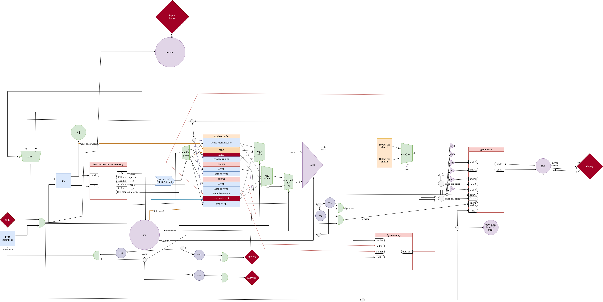

# NACA
## Brief story
**NACA** (not another computer architecture) is my 2023-2024 winter project that was inspired by computer architecture course at Innopolis University during
1st year of study. I tried to design my own *RISC* architecture with it's own instruction set and implement a processor in Verilog to run on FPGA board. 
The planning went smooth, however I didn't have time to finish the implementation, so the current state of the project is in the begining of implementation without any recent development.
## Architecture design
### Registers
NACA has 16 integer "general" purpose 32-bit registers
|Register code |Register name |Register shortname |
| --- | --- | ---|
| 0 | zero register | z | 
1 | general purpose | t0 |
2 | general purpose | t1 |
3 | general purpose | t2 |
4 | general purpose | t3 |
5 | general purpose | t4 |
6 | general purpose | t5 |
7 | system memory read | sr |
8 | system memory address | sa |
9 | system memory write | sw |
10 | graphic memory address | ga |
11 | graphic memory write | gw |
12 | system code | sys |
13 | compare register | cmp |
14 | memory for program counter | mpc |
15 | last keyboard input | key |

### Instruciton set
Each instruction is 32-bit. There are 4 types of instructions, and here are their bit representations:
Конечно! Вот обновленный вариант таблиц в формате Markdown:

#### Register Ops:

| jump? | opcode | dist_reg | a_reg | b_reg | zeros    |
|-------|--------|----------|-------|-------|----------|
| 1-bit | 5-bit  | 5-bit    | 5-bit | 5-bit | 11-bit   |

#### Immediate Ops:

| jump | opcode | dist_reg | a_reg | immediate_value |
|------|--------|----------|-------|------------------|
| 1-bit| 5-bit  | 5-bit    | 5-bit | 16-bit           |

#### Jump Instr:

| jump | opcode | to_instr_addr | from_instr_adr | zeros    |
|------|--------|----------------|-----------------|----------|
| 1-bit| 5-bit  | 12-bit         | 12-bit          | 15-bit   |

#### Ecall (Operates with Register SYS CALL):

| jump | opcode | zeros       |
|------|--------|--------------|
| 1-bit| 5-bit  | 25-bit       |

